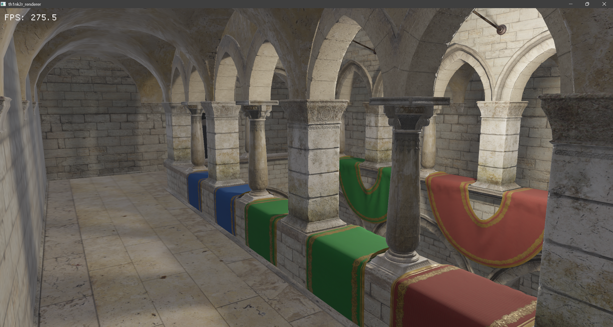
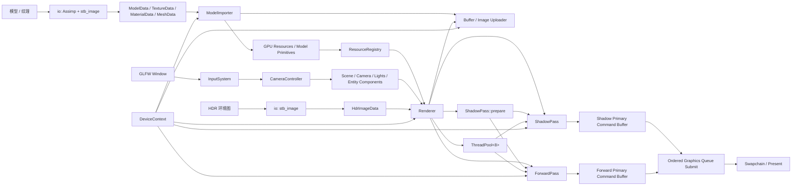

# th1nk2r_renderer

基于 **C++20** 与 **Vulkan 1.4** 构建的模块化实时渲染器。项目采用 Vulkan-Hpp RAII 管理 Vulkan 对象，使用 VMA 分配 GPU 内存，通过 Assimp、stb_image 与 Slang 建立模型导入、纹理处理和着色器编译链路。

渲染器将平台窗口、设备上下文、帧调度、资源系统、场景表达与渲染 Pass 分层组织，以清晰的所有权边界管理 GPU 资源。当前渲染路径支持 Metallic-Roughness PBR、基于计算着色器的 IBL 预计算、点光源 PCSS 全向软阴影、Mesh 级视锥剔除与天空盒渲染；帧内由八工作线程池调度阴影与前向两项主命令缓冲录制任务，并使用 Sponza 作为默认示例场景。

## 效果展示



## 核心能力

### 渲染

- **Metallic-Roughness PBR**：基于 Cook-Torrance BRDF，使用 GGX 法线分布、Smith 几何遮蔽与 Schlick Fresnel。
- **材质系统**：支持基础色、金属度-粗糙度、法线、环境遮蔽、自发光以及 Alpha Mask。
- **图像化照明（IBL）**：运行时通过计算着色器完成 HDR 等距柱状图到 Cubemap 的转换，并生成漫反射 Irradiance Map、Specular Prefilter Map 与 BRDF LUT。
- **全向软阴影**：点光源使用 Cubemap Array 保存六面深度，片元阶段通过 PCSS 完成遮挡物搜索与可变半影过滤。
- **天空盒与 HDR 色调映射**：直接显示环境 Cubemap，并对最终 HDR 光照结果执行 Reinhard Tone Mapping。
- **多点光源**：场景点光源经 Storage Buffer 上传；每盏灯可独立配置强度、颜色、阴影范围和光源半径。
- **Mesh 级视锥剔除**：前向 Pass 从相机 View-Projection 矩阵提取 Vulkan ZO 裁剪空间的六个视锥平面，以世界空间 AABB 逐 Mesh 判定可见性，并仅为可见 Mesh 记录材质绑定、网格绑定和索引绘制命令。

### 资源与场景

- 递归发现并导入 OBJ、FBX、glTF 与 GLB 模型。
- 支持外部或内嵌 JPEG/PNG 纹理，以及 HDR 环境图。
- 使用暂存 Buffer 批量上传顶点、索引和图像数据，并为 2D 纹理自动生成完整 Mipmap 链。
- `Mesh` 构造阶段遍历顶点位置生成模型空间 AABB，并将边界作为网格资源的只读元数据保存。
- CPU 导入数据、GPU 资源对象与 `ResourceRegistry` 分层管理，通过类型安全 `ResourceId` 引用资源。
- `ModelImporter` 负责模型目录扫描、GPU 资源创建与注册，并在同一导入器实例内缓存纹理及其 sRGB/UNORM 变体；导入结果返回模型与材质 ID，应用调用 `Renderer::prepare_resources()` 完成上传和材质绑定初始化。
- `Scene` 持有相机、实体和点光源；`Entity` 按类型管理 `Component`，通过 `Transform` 表达变换，通过 `MeshRenderer` 引用模型。阴影和前向 Pass 只绘制同时具有这两个组件的实体。
- `Model` 保存 `Primitive` 列表，每个 Primitive 分别引用网格与材质 ID，资源对象由注册表持有；自由飞行相机由输入系统驱动。

### 运行时与资源管理

- 使用 Vulkan-Hpp RAII 管理实例、设备、Swapchain、Pipeline、Descriptor 与同步对象的生命周期。
- 使用 Vulkan Memory Allocator（VMA）统一分配 Buffer 和 Image 显存。
- 双帧并行，使用 Fence 和 Semaphore 管理 CPU/GPU 与呈现同步。
- 使用包含八个常驻工作线程的任务队列调度命令录制；每帧投递 `ShadowPass` 与 `ForwardPass` 两项任务，主线程在提交前通过 `std::future` 等待两项录制任务完成并传播任务异常。
- 每个在途帧提供两个独立的命令录制槽位。每个槽位分别持有一个可重置 Command Pool 和一个以 `eOneTimeSubmit` 标志录制的 Primary Command Buffer，阴影与前向录制不共享 Command Pool。
- 阴影和前向 Command Buffer 按固定顺序组成同一个 Graphics Queue 提交：阴影命令在前，前向渲染命令在后。
- 优先选择 Mailbox Present Mode，不可用时回退到 FIFO。
- 处理窗口缩放、最小化、`VK_ERROR_OUT_OF_DATE_KHR` 与 Swapchain/图形管线重建。
- Debug 构建自动尝试启用 `VK_LAYER_KHRONOS_validation` 和 Debug Messenger。

## 设计原则

- **显式资源所有权**：Vulkan RAII 与不可复制资源类型确保对象按依赖顺序释放。
- **数据与运行时分离**：`io` 层解析文件并返回 CPU 数据；`ModelImporter` 将数据转换为 GPU 资源，注册表负责资源所有权与寻址。CPU 模型使用局部纹理、材质索引，运行时模型使用类型安全资源 ID。
- **统一渲染入口**：`Renderer` 持有 `ShadowPass`、`ForwardPass` 和命令录制线程池，负责材质绑定初始化、环境图设置、帧调度、交换链恢复与呈现；各 Pass 保留具体绘制实现。
- **主循环与图形 API 隔离**：`Renderer` 的渲染接口接收场景、资源 ID 和 CPU 图像数据，通过私有实现隐藏帧调度所需的 Vulkan 对象。`Application::loop()` 只处理事件、计时、场景更新和通用帧结果；应用仍持有 `DeviceContext`，用于构造 Renderer 和导入资源。
- **独立帧间计时**：`Application` 长期持有 `Timer`，通过 `std::chrono::steady_clock` 计算以秒为单位的帧间隔，默认限制最大时间步长为 `0.05F`。进入主循环和跳帧后重置计时基准。
- **并行录制资源隔离**：命令录制槽位按在途帧组织，每个槽位独占 Command Pool 与 Primary Command Buffer；相机、灯光和阴影资源同样按帧索引访问。
- **显式执行顺序**：CPU 侧并行生成两组命令，GPU 侧在单次 Queue Submit 中依次执行阴影与前向 Command Buffer。
- **统一资产部署**：构建过程统一编译 Slang 着色器并部署运行时资源。

## 技术栈

| 组件 | 用途 |
| --- | --- |
| C++20 / MSVC | 核心语言与 Windows x64 工具链 |
| Vulkan 1.4 / Vulkan-Hpp | 图形 API 与类型安全 RAII 封装 |
| Slang | Vertex、Fragment、Compute Shader 与 SPIR-V 编译 |
| GLFW | 窗口、输入和 Vulkan Surface |
| GLM | 向量、矩阵与四元数运算 |
| Vulkan Memory Allocator | GPU 内存分配 |
| Assimp 6.0.4 | 模型、网格和材质导入 |
| stb_image | JPEG、PNG 与 HDR 图像解码 |
| Xmake | 依赖解析、构建和运行时资源部署 |

## 架构

项目按平台、设备、资源、场景和渲染职责拆分模块。`DeviceContext` 聚合 Vulkan 设备级基础设施，`Renderer` 在私有实现中持有交换链、在途帧、阴影 Pass、前向 Pass 和 `ThreadPool<8>`，统一组织帧内录制与呈现。Renderer 构造时绑定设备上下文、窗口和只读资源注册表引用，这些对象的生命周期均长于 Renderer；各 Pass 使用该注册表解析场景组件中的模型 ID，以及模型 Primitive 中的网格、材质 ID，并独立维护其管线、描述符和命令记录逻辑。应用通过 `Renderer::prepare_resources()` 完成上传和材质绑定初始化，通过 `set_environment()` 设置环境图，并通过 `render(scene)` 请求渲染。



核心模块职责：

| 模块 | 职责 |
| --- | --- |
| `core` | 应用生命周期、资源装载、主循环、Timer 帧间计时、输入调度与通用线程池实现 |
| `platform` | GLFW 窗口及事件回调封装 |
| `gfx/device` | Vulkan 实例与设备、VMA、Buffer/Image 上传器 |
| `gfx/frame` | Swapchain、深度附件、Framebuffer、帧同步与按帧隔离的命令录制槽位 |
| `gfx/pipeline` | 图形管线创建与固定功能状态配置 |
| `gfx/resource` | VMA Buffer/Image 封装与资源描述 |
| `io` | SPIR-V 读取校验、Assimp 模型解析与图像解码，返回 CPU 数据 |
| `resource` | CPU/GPU 资源、模型导入器、材质、网格、模型与资源注册表 |
| `scene` | 相机、点光源、实体与组件管理；Transform 变换和 MeshRenderer 模型引用 |
| `render` | 统一渲染入口、Pass 所有权、并行录制调度、材质与环境设置、交换链恢复及呈现 |
| `render/pass/shadow` | 点光源 Cubemap Array 深度生成与阴影描述符输出 |
| `render/pass/forward` | Mesh 级视锥剔除、PBR 前向着色、IBL 预计算、材质/相机/灯光描述符与天空盒 |

### 启动阶段

1. `Application` 创建场景、GLFW 窗口、设备上下文、资源注册表、输入系统和 Timer；设备上下文创建 Vulkan 实例、Surface、物理/逻辑设备、VMA 和上传器。
2. `Renderer` 创建 Swapchain、帧同步与命令录制资源、阴影 Pass、前向 Pass 和八工作线程池。
3. `Application` 调用 `ModelImporter` 递归扫描 `assets/models/`，导入并注册模型、材质与纹理。
4. `Renderer::prepare_resources()` 提交暂存上传、生成纹理 Mipmap，并初始化两个 Pass 的材质绑定。
5. 加载 HDR 环境图，通过 `Renderer::set_environment()` 使用 Compute Shader 生成 IBL 所需的 Cubemap 与查找表。
6. 创建具有 `Transform` 和 `MeshRenderer` 的默认 Sponza 实体，设置相机位置和投射阴影的点光源；进入主循环前重置 Timer。

### 单帧流程

```text
处理窗口事件
  -> Timer 采样帧间隔，更新应用状态
  -> 调用 Renderer::render(scene)
  -> Renderer 检查窗口状态
      -> 窗口已关闭：返回 Skipped
      -> 窗口尺寸变化：恢复交换链与前向管线，返回 Skipped
      -> 正常：继续本帧
  -> 等待当前帧 Fence
  -> 获取 Swapchain Image
      -> OutOfDate：恢复交换链与前向管线，返回 Skipped
      -> Success / Suboptimal：继续本帧
  -> 准备当前帧的阴影面数据与灯光绑定
  -> 将 ShadowPass 与 ForwardPass 两项录制任务分派至八工作线程池
      -> 槽位 0：录制阴影 Primary Command Buffer，为投影点光源生成六面深度
      -> 槽位 1：更新 Camera / Light Buffer，完成视锥剔除，并录制包含 PBR 绘制与天空盒的前向 Primary Command Buffer
  -> 等待两项录制任务完成并取得执行结果
  -> 按 Shadow、Forward 顺序通过一次 Graphics Queue Submit 提交两个 Command Buffer
  -> Present
  -> 推进在途帧索引
  -> Acquire 为 Suboptimal，或 Present 为 OutOfDate / Suboptimal：恢复交换链与前向管线，返回 Skipped
  -> 否则返回 Rendered
```

恢复交换链时，Renderer 在帧缓冲尺寸为零的情况下等待窗口事件，直到窗口恢复或关闭；窗口未关闭时等待 GPU 空闲，重建交换链及前向、天空盒管线。`Skipped` 会结束本次 `render()` 调用，应用随即重置 Timer；呈现后的恢复分支可能已经提交过本帧命令。其他异常继续向上传播。主循环退出时调用 `Renderer::wait_idle()`。

## 项目结构

```text
th1nk2r_renderer/
├─ assets/                         # 示例场景、纹理、HDR 与资产授权说明
├─ docs/images/                    # 渲染效果截图
├─ include/
│  ├─ core/                        # Application、Timer、输入系统与通用线程池
│  ├─ gfx/                         # Vulkan 设备、资源、帧和管线
│  ├─ io/                          # 模型解析、图像解码与 SPIR-V 读取
│  ├─ platform/                    # 窗口抽象
│  ├─ render/                      # Renderer 与 Forward / Shadow Pass
│  ├─ resource/                    # CPU/GPU 资源、Importer 和 Registry
│  └─ scene/                       # Camera、Light、Entity、Component 与组件
├─ shaders/
│  ├─ vertex/                      # 顶点着色器
│  ├─ fragment/                    # 片元着色器
│  └─ compute/                     # 计算着色器
├─ src/                            # 与 include/ 对应的实现
├─ bin/                            # 可执行文件、SPIR-V 与运行时资产（构建生成）
├─ LICENSE
└─ xmake.lua
```

## 环境要求

当前构建配置面向 **Windows x64 + MSVC**：

- Windows 10/11 x64。
- Visual Studio 2022 或 Build Tools，安装“使用 C++ 的桌面开发”工作负载。
- [Xmake](https://xmake.io/)。
- 可通过 `PATH` 直接调用的 [`slangc`](https://github.com/shader-slang/slang)。
- 支持 Vulkan 1.4 的显卡、驱动和 Vulkan Runtime。
- GPU 需要有同时支持 Graphics 和 Compute 的队列族，并支持窗口呈现、`VK_KHR_swapchain`、`imageCubeArray` 和 `shaderDrawParameters`；呈现队列可以属于另一队列族。
- 材质纹理需要 RGBA8 sRGB/UNORM 的采样支持，生成 Mipmap 时还需要线性 Blit 支持；IBL 使用 RGBA32F，需要采样、线性过滤、Storage Image 和 Blit 支持；阴影深度格式需要同时支持深度附件与采样。这些能力在资源初始化阶段单独检查。
- 推荐安装 Vulkan SDK，以便在 Debug 构建中使用 Khronos Validation Layer 和调试工具。

可以先检查本地工具：

```powershell
xmake --version
slangc -version
```

GLFW、GLM、VMA、stb、Assimp 与 Vulkan SDK 已在 `xmake.lua` 中声明，Xmake 会在首次配置时解析依赖，因此首次构建可能需要网络连接。

## 构建与运行

克隆项目：

```powershell
git clone https://github.com/th1nk2r-git/th1nk2r_renderer.git
Set-Location .\th1nk2r_renderer
```

Debug 构建：

```powershell
xmake f -m debug
xmake
xmake run th1nk2r_renderer
```

Release 构建：

```powershell
xmake f -m release
xmake
xmake run th1nk2r_renderer
```

构建后会得到：

```text
bin/
├─ th1nk2r_renderer.exe
├─ spv/                            # 编译后的图形与计算着色器
└─ assets/                         # 部署后的运行时资产
```

程序使用 `./spv` 和 `./assets` 相对路径。若不通过 `xmake run` 启动，请从 `bin/` 目录运行：

```powershell
Push-Location .\bin
.\th1nk2r_renderer.exe
Pop-Location
```

> `xmake.lua` 会在每次构建后调用 `slangc`，以 `main` 为入口将 `shaders/vertex`、`shaders/fragment` 和 `shaders/compute` 中的 `.slang`/`.hlsl` 编译到 `bin/spv/`，并将 `assets/` 复制到 `bin/assets/`。

## 操作方式

程序启动后默认捕获鼠标；系统支持时会启用 Raw Mouse Motion。

| 输入 | 操作 |
| --- | --- |
| 鼠标移动 | 旋转视角 |
| `W` / `S` | 前进 / 后退 |
| `A` / `D` | 左移 / 右移 |
| `Space` / `Left Ctrl` | 上升 / 下降 |
| `Left Shift` 或 `Right Shift` | 加速移动 |
| 按住 `Left Alt` 或 `Right Alt` | 临时释放鼠标，并暂停相机旋转和移动 |
| 释放 `Alt` | 重新捕获鼠标 |

## 资源约定与定制

`ModelImporter::import_models()` 会递归扫描指定目录（当前为 `assets/models/`），识别 `.obj`、`.fbx`、`.gltf` 和 `.glb`。模型注册名遵循以下规则：

- 默认使用模型文件所在文件夹的名字。例如，`assets/models/sponza/Sponza.gltf` 注册为 `sponza`，`assets/models/blocks/rocky_soil_smooth/rocky_soil_smooth_preview.glb` 注册为 `rocky_soil_smooth`。
- 名称与扫描根目录、上层目录和模型文件名无关；直接放在扫描根目录中的模型使用该根目录的文件夹名。
- 不同模型必须拥有唯一注册名。同一文件夹中的多个模型，或不同位置的同名文件夹会产生重名，导入器会报错；建议每个模型放在名称唯一的独立目录中。

`ModelImporter::import_model()` 支持导入单个模型，默认同样使用模型所在文件夹的名字，也可以传入显式名称。两个导入接口只排队上传数据；应用在使用资源前调用 `Renderer::prepare_resources()`，由 Renderer 提交 `BufferUploader` 和 `ImageUploader` 并初始化材质绑定。`io` 层继续负责解析文件并返回 CPU 数据，`ResourceRegistry` 只负责持有和查询资源。

`prepare_resources()` 应传入尚未初始化绑定的材质 ID；重复传入同一材质会抛出异常。当前环境图只支持初始化一次，首次渲染前必须调用 `set_environment()`，重复设置同样会抛出异常。

当前示例启动时导入 `assets/models/` 下的全部模型，包括 `blocks/` 中的材质预览 GLB，但只在 `Application::setup_scene()` 中为 `sponza` 创建实体。环境图在 `Application::run()` 中加载，路径为 `assets/models/sponza/mud_road_puresky_2k.hdr`。替换默认示例时可分别修改实体使用的模型注册名和环境图路径。

创建可绘制实体的方式：

```cpp
auto& entity = scene_.create_entity();
entity.add_component<Transform>();
entity.add_component<MeshRenderer>(registry_.query_model_id("sponza"));
```

`create_entity()` 创建空实体，不自动添加组件；需要包含 `scene/components/transform.hpp` 和 `scene/components/mesh_renderer.hpp`。

材质导入支持以下数据：

| 数据 | 处理方式 |
| --- | --- |
| Base Color | 因子 × 顶点色 × sRGB 纹理 |
| Metallic / Roughness | 材质因子 × 线性数据纹理 B/G 通道 |
| Normal | 切线空间法线贴图与强度参数 |
| Occlusion | 线性纹理 R 通道与强度参数 |
| Emissive | 自发光颜色因子 × sRGB 纹理 |
| Alpha Mask | glTF `MASK` 模式与 Alpha Cutoff；阴影 Pass 同步裁剪 |

## 关键实现参数

| 参数 | 当前值 |
| --- | --- |
| Frames in Flight | 2 |
| 命令录制工作线程 | 8 个常驻线程 |
| 每帧命令录制任务 | 2 项；分别录制 Shadow 与 Forward Command Buffer |
| 每个在途帧的录制槽位 | 2 个；每个槽位独占 1 个 Command Pool 与 1 个 `eOneTimeSubmit` Primary Command Buffer |
| 帧内命令提交 | 1 次 Graphics Queue Submit；依次提交 Shadow、Forward 两个 Command Buffer |
| 默认窗口 | 1200 × 800 |
| Timer 最大时间步长 | 0.05 秒；进入主循环和 Skipped 后重置基准 |
| 视锥剔除 | Forward Pass；Mesh 粒度；世界空间 AABB；Vulkan ZO 六平面测试 |
| 阴影贴图 | 每个在途帧独立的 Cubemap Array；每面 512 × 512，共 48 层 |
| 最大点光源数 | 1024 |
| 最大投影点光源数 | 8；按场景顺序选择，超出的点光源仍参与照明 |
| 最大材质数 | 每个 Pass 的材质绑定容量为 1024 |
| PCSS 采样 | 24 次遮挡物搜索；找到遮挡物后再进行 24 次过滤 |
| Environment Cubemap | 512 × 512，完整 Mip 链 |
| Irradiance Cubemap | 32 × 32 |
| Prefiltered Cubemap | 128 × 128，完整 Mip 链 |
| BRDF LUT | 256 × 256 |
| IBL 积分采样 | 256 |

## 常见问题

### 构建时报错：`slangc` 无法识别

安装 Slang，并将包含 `slangc.exe` 的目录加入 `PATH`。重新打开终端后运行 `slangc -version` 验证。

### 启动时报错：无法读取 `.spv` 或资源文件

先完整执行一次 `xmake`，确认 `bin/spv/` 和 `bin/assets/` 已生成。手动启动时必须将 `bin/` 作为当前工作目录。

### 启动时报错：`failed to find a suitable GPU!`

确认显卡驱动支持 Vulkan 1.4，并满足同一队列族的图形/计算能力、呈现、`VK_KHR_swapchain`、`imageCubeArray` 与 `shaderDrawParameters` 要求。

### Debug 构建提示 Validation Layer 不可用

程序会输出警告并继续运行。安装带有 `VK_LAYER_KHRONOS_validation` 的 Vulkan SDK 后即可启用验证层。

## License

本项目原创源代码、Slang 着色器与项目文档采用 [MIT License](LICENSE)。

`assets/` 下的模型、纹理、HDR 及其他媒体文件不属于仓库根目录的 MIT 授权范围，继续受原作者许可条款约束。发布或商业使用前请务必查看 [assets/README.md](assets/README.md)；其中部分示例资产的再分发授权仍待确认。

第三方依赖分别适用其各自许可证。
