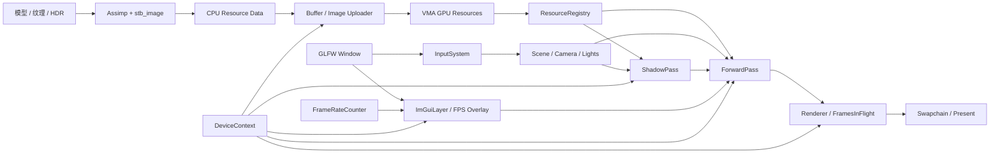

# th1nk2r_renderer

基于 **C++20** 与 **Vulkan 1.4** 构建的模块化实时渲染器。项目采用 Vulkan-Hpp RAII 管理 Vulkan 对象，使用 VMA 分配 GPU 内存，通过 Assimp、stb_image 与 Slang 建立模型导入、纹理处理和着色器编译链路，并使用 Dear ImGui 提供运行时性能覆盖层。

渲染器将平台窗口、设备上下文、帧调度、资源系统、场景表达与渲染 Pass 分层组织，以清晰的所有权边界管理 GPU 资源。当前渲染路径支持 Metallic-Roughness PBR、基于计算着色器的 IBL 预计算、点光源 PCSS 全向软阴影与天空盒渲染，并使用 Sponza 作为默认示例场景。

## 核心能力

### 渲染

- **Metallic-Roughness PBR**：基于 Cook-Torrance BRDF，使用 GGX 法线分布、Smith 几何遮蔽与 Schlick Fresnel。
- **材质系统**：支持基础色、金属度-粗糙度、法线、环境遮蔽、自发光以及 Alpha Mask。
- **图像化照明（IBL）**：运行时通过计算着色器完成 HDR 等距柱状图到 Cubemap 的转换，并生成漫反射 Irradiance Map、Specular Prefilter Map 与 BRDF LUT。
- **全向软阴影**：点光源使用 Cubemap Array 保存六面深度，片元阶段通过 PCSS 完成遮挡物搜索与可变半影过滤。
- **天空盒与 HDR 色调映射**：直接显示环境 Cubemap，并对最终 HDR 光照结果执行 Reinhard Tone Mapping。
- **多点光源**：场景点光源经 Storage Buffer 上传；每盏灯可独立配置强度、颜色、阴影范围和光源半径。

### 资源与场景

- 递归发现并导入 OBJ、FBX、glTF 与 GLB 模型。
- 支持外部或内嵌 JPEG/PNG 纹理，以及 HDR 环境图。
- 使用暂存 Buffer 批量上传顶点、索引和图像数据，并为 2D 纹理自动生成完整 Mipmap 链。
- CPU 导入数据、GPU 资源对象与 `ResourceRegistry` 分层管理，通过类型安全 `ResourceId` 引用资源。
- 提供轻量级 `Scene`、`Entity`、`Transform`、`Camera` 与自由飞行相机控制器。

### 运行时与资源管理

- 使用 Vulkan-Hpp RAII 管理实例、设备、Swapchain、Pipeline、Descriptor 与同步对象的生命周期。
- 使用 Vulkan Memory Allocator（VMA）统一分配 Buffer 和 Image 显存。
- 双帧并行，使用 Fence 和 Semaphore 管理 CPU/GPU 与呈现同步。
- 使用 `FrameRateCounter` 统计渲染吞吐率，并通过 Dear ImGui 在左上角显示每秒更新的一秒平均帧率。
- 优先选择 Mailbox Present Mode，不可用时回退到 FIFO。
- 处理窗口缩放、最小化、`VK_ERROR_OUT_OF_DATE_KHR` 与 Swapchain/图形管线重建。
- Debug 构建自动尝试启用 `VK_LAYER_KHRONOS_validation` 和 Debug Messenger。

### 性能覆盖层

- `Application` 持有 `FrameRateCounter` 和 `ImGuiLayer`，在帧循环开始和成功完成 `Renderer::render()` 后分别调用帧率统计接口。
- `FrameRateCounter` 使用 `std::chrono::steady_clock` 计时。采样时间达到一秒后，以成功完成的帧数除以实际采样时长，并保存本次区间的平均 FPS。
- `ImGuiLayer` 创建并销毁 Dear ImGui Context，初始化 GLFW 与 Vulkan 后端，并关闭 ImGui 配置文件输出。
- FPS 窗口固定在主视口坐标 `(10, 10)`，使用无装饰、自动尺寸、无输入、透明背景和零边框配置；文字基础字号为 `40.0`。
- `ImGuiLayer` 在每帧生成 FPS 窗口的 Draw Data。`ForwardPass` 绘制场景与天空盒后，通过 Overlay 回调将 Draw Data 记录到当前 Command Buffer，再结束主 Render Pass。
- `Renderer` 暴露实际 Swapchain Image 数量。Swapchain 重建完成后，`Application` 使用新的 Render Pass 和 Image 数量重新初始化 ImGui Vulkan 后端。

## 设计原则

- **显式资源所有权**：Vulkan RAII 与不可复制资源类型确保对象按依赖顺序释放。
- **数据与运行时分离**：CPU 导入数据、GPU 资源对象和注册表分别承担解析、驻留与寻址职责。
- **渲染职责解耦**：`Renderer` 负责帧调度与呈现，`ShadowPass` 和 `ForwardPass` 分别负责阴影与主渲染命令。
- **帧内资源隔离**：命令缓冲、同步对象、相机数据、灯光数据与阴影资源按帧组织。
- **可复现资产管线**：构建过程统一编译 Slang 着色器并部署运行时资源。

## 技术栈

| 组件 | 用途 |
| --- | --- |
| C++20 / MSVC | 核心语言与 Windows x64 工具链 |
| Vulkan 1.4 / Vulkan-Hpp | 图形 API 与类型安全 RAII 封装 |
| Slang | Vertex、Fragment、Compute Shader 与 SPIR-V 编译 |
| GLFW | 窗口、输入和 Vulkan Surface |
| Dear ImGui 1.92.9b | Vulkan 帧率覆盖层 |
| GLM | 向量、矩阵与四元数运算 |
| Vulkan Memory Allocator | GPU 内存分配 |
| Assimp 6.0.4 | 模型、网格和材质导入 |
| stb_image | JPEG、PNG 与 HDR 图像解码 |
| Xmake | 依赖解析、构建和运行时资源部署 |

## 架构

项目按平台、设备、资源、场景、UI 和渲染职责拆分模块。`DeviceContext` 聚合 Vulkan 设备级基础设施，`Renderer` 管理帧调度与呈现，各渲染 Pass 独立维护其管线、描述符和命令记录逻辑，`ImGuiLayer` 负责性能覆盖层的生命周期与命令记录。



核心模块职责：

| 模块 | 职责 |
| --- | --- |
| `core` | 应用生命周期、资源装载、主循环、输入调度与帧率统计 |
| `platform` | GLFW 窗口及事件回调封装 |
| `gfx/device` | Vulkan 实例与设备、VMA、Buffer/Image 上传器 |
| `gfx/frame` | Swapchain、深度附件、Framebuffer 与帧同步 |
| `gfx/pipeline` | 图形管线创建与固定功能状态配置 |
| `io` | SPIR-V、模型与图像读取 |
| `resource` | CPU/GPU 资源、材质、网格、模型与资源注册表 |
| `scene` | 相机、实体、Transform 与点光源 |
| `ui` | Dear ImGui 生命周期、Vulkan 后端与 FPS 覆盖层 |
| `render/pass/shadow` | 点光源 Cubemap Array 深度生成与阴影描述符输出 |
| `render/pass/forward` | PBR 前向着色、IBL 预计算、材质/相机/灯光描述符与天空盒 |

### 启动阶段

1. 创建 GLFW 窗口、Vulkan 实例、Surface、物理/逻辑设备和 Swapchain。
2. 创建帧同步资源、阴影 Pass、前向 Pass 与 ImGui 性能覆盖层。
3. 递归扫描 `assets/`，导入模型、材质与纹理。
4. 通过暂存资源将网格和图像批量上传至 GPU，并生成纹理 Mipmap。
5. 加载 HDR 环境图，使用 Compute Shader 生成 IBL 所需的 Cubemap 与查找表。
6. 注册资源，创建默认 Sponza 实体、相机和投射阴影的点光源。

### 单帧流程

```text
开始帧率计时并处理窗口事件
  -> 更新应用状态，生成 ImGui FPS Draw Data
  -> 等待当前帧 Fence
  -> 获取 Swapchain Image
  -> 更新 Camera / Light Buffer
  -> ShadowPass：为投影点光源记录六面深度
  -> ForwardPass：PBR 实体绘制 + 天空盒 + ImGui FPS 覆盖层
  -> 提交 Graphics Queue
  -> Present
  -> 完成帧率计数，采样满一秒时更新平均 FPS
```

## 项目结构

```text
th1nk2r_renderer/
├─ assets/                         # 示例场景、纹理、HDR 与资产授权说明
├─ include/
│  ├─ core/                        # Application 与输入系统
│  ├─ gfx/                         # Vulkan 设备、资源、帧和管线
│  ├─ io/                          # 资源读取接口
│  ├─ platform/                    # 窗口抽象
│  ├─ render/pass/                 # Forward Pass 与 Shadow Pass
│  ├─ resource/                    # CPU/GPU 资源和 Registry
│  ├─ scene/                       # Camera、Entity、Transform、Light
│  └─ ui/                          # ImGuiLayer 与性能覆盖层
├─ shaders/
│  ├─ vertex/                      # 顶点着色器
│  ├─ fragment/                    # 片元着色器
│  └─ compute/                     # 计算着色器
├─ src/                            # 与 include/ 对应的实现
├─ bin/                            # 可执行文件、SPIR-V 与运行时资产（构建生成）
├─ LICENSE
└─ xmake.lua
```

## 环境要求

当前构建配置面向 **Windows x64 + MSVC**：

- Windows 10/11 x64。
- Visual Studio 2022 或 Build Tools，安装“使用 C++ 的桌面开发”工作负载。
- [Xmake](https://xmake.io/)。
- 可通过 `PATH` 直接调用的 [`slangc`](https://github.com/shader-slang/slang)。
- 支持 Vulkan 1.4 的显卡、驱动和 Vulkan Runtime。
- GPU 需要支持图形与计算队列、窗口呈现、`VK_KHR_swapchain`、`imageCubeArray` 和 `shaderDrawParameters`。
- 推荐安装 Vulkan SDK，以便在 Debug 构建中使用 Khronos Validation Layer 和调试工具。

可以先检查本地工具：

```powershell
xmake --version
slangc -version
```

GLFW、Dear ImGui、GLM、VMA、stb、Assimp 与 Vulkan SDK 已在 `xmake.lua` 中声明，Xmake 会在首次配置时解析依赖，因此首次构建可能需要网络连接。

## 构建与运行

克隆项目：

```powershell
git clone https://github.com/th1nk2r-git/th1nk2r_renderer.git
Set-Location .\th1nk2r_renderer
```

Debug 构建：

```powershell
xmake f -m debug
xmake
xmake run th1nk2r_renderer
```

Release 构建：

```powershell
xmake f -m release
xmake
xmake run th1nk2r_renderer
```

构建后会得到：

```text
bin/
├─ th1nk2r_renderer.exe
├─ spv/                            # 编译后的图形与计算着色器
└─ assets/                         # 部署后的运行时资产
```

程序使用 `./spv` 和 `./assets` 相对路径。若不通过 `xmake run` 启动，请从 `bin/` 目录运行：

```powershell
Push-Location .\bin
.\th1nk2r_renderer.exe
Pop-Location
```

> `xmake.lua` 会在每次构建后调用 `slangc`，以 `main` 为入口将 `shaders/vertex`、`shaders/fragment` 和 `shaders/compute` 中的 `.slang`/`.hlsl` 编译到 `bin/spv/`，并将 `assets/` 复制到 `bin/assets/`。

## 操作方式

程序启动后默认捕获鼠标；系统支持时会启用 Raw Mouse Motion。

| 输入 | 操作 |
| --- | --- |
| 鼠标移动 | 旋转视角 |
| `W` / `S` | 前进 / 后退 |
| `A` / `D` | 左移 / 右移 |
| `Space` / `Left Ctrl` | 上升 / 下降 |
| `Left Shift` 或 `Right Shift` | 加速移动 |
| 按住 `Left Alt` 或 `Right Alt` | 临时释放鼠标 |
| 释放 `Alt` | 重新捕获鼠标 |

## 资源约定与定制

应用会递归扫描 `assets/`，识别 `.obj`、`.fbx`、`.gltf` 和 `.glb`。模型注册名遵循以下规则：

- `assets/<目录>/<模型文件>` 使用相对目录作为注册名。例如，`assets/sponza/Sponza.gltf` 注册为 `sponza`。
- 直接位于 `assets/` 的模型使用不带扩展名的文件名。
- 不同模型必须拥有唯一注册名，建议每个模型放在独立目录中。

当前示例在 `Application::setup_scene()` 中查询 `sponza`，并在 `Application::run()` 中加载 `assets/sponza/mud_road_puresky_2k.hdr`。替换默认场景时，需要同步修改这两处配置。

材质导入支持以下数据：

| 数据 | 处理方式 |
| --- | --- |
| Base Color | 因子 × 顶点色 × sRGB 纹理 |
| Metallic / Roughness | 材质因子 × 线性数据纹理 B/G 通道 |
| Normal | 切线空间法线贴图与强度参数 |
| Occlusion | 线性纹理 R 通道与强度参数 |
| Emissive | 自发光颜色因子 × sRGB 纹理 |
| Alpha Mask | glTF `MASK` 模式与 Alpha Cutoff；阴影 Pass 同步裁剪 |

## 关键实现参数

| 参数 | 当前值 |
| --- | --- |
| Frames in Flight | 2 |
| FPS 采样周期 | 1 秒，非重叠窗口 |
| FPS 显示 | 坐标 `(10, 10)`；基础字号 `40.0`；透明背景；零边框 |
| 默认窗口 | 1200 × 800 |
| 阴影贴图 | 每帧 512 × 512 Cubemap Array |
| 最大投影点光源数 | 8 |
| PCSS 采样 | 24 次遮挡物搜索 + 24 次过滤 |
| Environment Cubemap | 512 × 512，完整 Mip 链 |
| Irradiance Cubemap | 32 × 32 |
| Prefiltered Cubemap | 128 × 128，完整 Mip 链 |
| BRDF LUT | 256 × 256 |
| IBL 积分采样 | 256 |

## 常见问题

### 构建时报错：`slangc` 无法识别

安装 Slang，并将包含 `slangc.exe` 的目录加入 `PATH`。重新打开终端后运行 `slangc -version` 验证。

### 启动时报错：无法读取 `.spv` 或资源文件

先完整执行一次 `xmake`，确认 `bin/spv/` 和 `bin/assets/` 已生成。手动启动时必须将 `bin/` 作为当前工作目录。

### 启动时报错：`failed to find a suitable GPU!`

确认显卡驱动支持 Vulkan 1.4，并满足图形/计算队列、呈现、`VK_KHR_swapchain`、`imageCubeArray` 与 `shaderDrawParameters` 要求。

### Debug 构建提示 Validation Layer 不可用

程序会输出警告并继续运行。安装带有 `VK_LAYER_KHRONOS_validation` 的 Vulkan SDK 后即可启用验证层。

## License

本项目原创源代码、Slang 着色器与项目文档采用 [MIT License](LICENSE)。

`assets/` 下的模型、纹理、HDR 及其他媒体文件不属于仓库根目录的 MIT 授权范围，继续受原作者许可条款约束。发布或商业使用前请务必查看 [assets/README.md](assets/README.md)；其中部分示例资产的再分发授权仍待确认。

第三方依赖分别适用其各自许可证。
