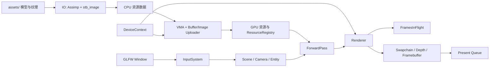

# th1nk2r_renderer

基于 **C++20** 与 **Vulkan 1.4** 构建的模块化实时渲染器。项目采用 Vulkan-Hpp RAII 管理 Vulkan 对象，使用 VMA 分配 GPU 内存，并通过 Assimp、stb_image 与 Slang 建立完整的模型导入、纹理处理和着色器编译链路。

渲染器将平台窗口、设备上下文、帧调度、资源系统、场景表达与渲染 Pass 分层组织，以清晰的所有权边界管理 GPU 资源。随项目提供的 Sponza 场景用于展示从资产导入、显存上传到索引绘制和交换链呈现的完整实时渲染流程。

## 核心能力

- Vulkan 1.4 实例、窗口 Surface、物理设备和逻辑设备初始化
- Debug 模式下的 Khronos Validation Layer 与调试消息
- Vulkan-Hpp RAII 对象封装和 Vulkan Memory Allocator（VMA）资源分配
- 支持 OBJ、FBX、glTF 和 GLB 的递归模型导入
- 支持外部及内嵌 JPEG/PNG 纹理，统一解码为 RGBA8
- GPU 顶点缓冲、索引缓冲和纹理暂存上传
- 自动生成完整纹理 mip 链
- 场景、实体、Transform、相机和类型安全资源 ID
- 基于材质描述符与模型矩阵 Push Constant 的前向渲染
- 深度测试、深度缓冲和索引绘制
- 双帧并行、Fence/Semaphore 同步和交换链图像级呈现同步
- 窗口缩放、最小化恢复和交换链/图形管线重建
- 自由相机与原始鼠标输入（系统支持时）
- Slang 着色器在构建后自动编译为 SPIR-V

## 设计原则

- **显式资源所有权**：Vulkan RAII 与不可复制资源类型确保对象按依赖顺序释放。
- **数据与运行时分离**：CPU 导入数据、GPU 资源对象和注册表分别承担解析、驻留与寻址职责。
- **渲染职责解耦**：`Renderer` 负责帧调度与呈现，`ForwardPass` 负责管线状态、描述符和绘制命令。
- **帧内资源隔离**：相机 Uniform Buffer、命令缓冲和同步对象按帧组织，支持双帧并行。
- **可复现资产管线**：构建过程统一编译 Slang 着色器并部署运行时资源。

## 技术栈

| 组件 | 用途 |
| --- | --- |
| C++20 / MSVC | 核心语言与 Windows 工具链 |
| Vulkan 1.4 | 图形 API |
| Vulkan-Hpp RAII | Vulkan 类型安全接口与对象生命周期管理 |
| GLFW | 窗口、输入事件与 Vulkan Surface |
| GLM | 向量、矩阵和四元数运算 |
| Vulkan Memory Allocator | Buffer 与 Image 的显存分配 |
| Assimp 6.0.4 | OBJ、FBX、glTF、GLB 模型和材质导入 |
| stb_image | JPEG/PNG 解码 |
| Slang | 着色器编写与 SPIR-V 编译 |
| Xmake | 项目配置、依赖解析与构建 |

## 环境要求

项目构建目标为 Windows x64 + MSVC，需要：

- Windows x64
- Visual Studio 或 Build Tools，并安装“使用 C++ 的桌面开发”工作负载
- [Xmake](https://xmake.io/)
- Vulkan 1.4 或更高版本的 Vulkan Runtime、GPU 与显卡驱动；**最低 Vulkan API 版本为 1.4**，并需支持图形队列、窗口呈现和 `VK_KHR_swapchain`
- 可在 `PATH` 中直接调用的 `slangc`
- 推荐安装 Vulkan SDK，以提供验证层及常用调试工具

可以先检查必要工具：

```powershell
xmake --version
slangc -version
```

> GLFW、GLM、VMA、stb、Assimp 和 Vulkan SDK 已在 `xmake.lua` 中声明。Xmake 会在首次配置或构建时解析这些依赖，过程中可能需要网络连接。

## 快速开始

```powershell
git clone https://github.com/th1nk2r-git/th1nk2r_renderer.git
Set-Location .\th1nk2r_renderer

xmake f -m debug
xmake
xmake run application
```

Release 构建：

```powershell
xmake f -m release
xmake
xmake run application
```

构建完成后，Xmake 会：

- 将可执行文件输出到 `bin/application.exe`
- 将着色器编译到 `bin/spv/`
- 将 `assets/` 复制到 `bin/assets/`

如需直接运行可执行文件，请将 `bin/` 设为当前工作目录，因为程序使用 `./spv` 和 `./assets` 相对路径：

```powershell
Set-Location .\bin
.\application.exe
```

## 操作方式

程序启动后默认捕获鼠标。

| 输入 | 操作 |
| --- | --- |
| 鼠标移动 | 旋转视角 |
| `W` / `S` | 前进 / 后退 |
| `A` / `D` | 左移 / 右移 |
| `Space` / `Left Ctrl` | 上升 / 下降 |
| `Left Shift` 或 `Right Shift` | 加速移动 |
| 按住 `Left Alt` 或 `Right Alt` | 临时释放鼠标 |
| 释放 `Alt` | 重新捕获鼠标 |

## 架构



核心模块职责如下：

| 模块 | 职责 |
| --- | --- |
| `core` | 应用生命周期、主循环和输入调度 |
| `platform` | GLFW 窗口及回调封装 |
| `gfx/device` | Vulkan 上下文、设备、VMA 与上传器 |
| `gfx/frame` | 交换链、深度资源、Framebuffer 和帧同步 |
| `gfx/pipeline` | 可配置图形管线创建 |
| `io` | SPIR-V、模型和图像读取 |
| `resource/cpu` | 导入后的 CPU 侧数据结构 |
| `resource/gpu` | Buffer、Texture、Material、Mesh 和 Model |
| `resource/registry` | 类型安全资源池及模型名称索引 |
| `scene` | Camera、Entity 和 Transform |
| `render/pass/forward` | 相机/材质描述符和前向绘制命令记录 |

### 启动数据流

1. 创建窗口、Vulkan 上下文、设备、交换链和前向渲染管线。
2. 递归扫描 `./assets` 下的支持格式模型。
3. Assimp 将网格和材质转换为 CPU 数据，stb_image 将纹理解码为 RGBA8。
4. 暂存上传器将顶点、索引和纹理传输至 GPU；纹理在传输命令中生成 mipmap。
5. 材质与模型进入 `ResourceRegistry`，应用按名称查询 `sponza` 并创建场景实体。
6. 主循环更新自由相机，并交由 `ForwardPass` 记录绘制命令。

### 单帧渲染流程

1. 等待当前帧的 Fence，并从交换链获取图像。
2. 更新当前帧相机 Uniform Buffer。
3. 开始 Render Pass，清理颜色与深度附件。
4. 绑定图形管线、相机描述符和实体模型矩阵。
5. 为每个 Mesh 绑定材质描述符、顶点/索引缓冲并执行 `drawIndexed`。
6. 提交图形队列、等待渲染完成信号并呈现交换链图像。
7. 遇到窗口尺寸变化、`SUBOPTIMAL` 或 `OUT_OF_DATE` 时重建交换链与管线。

## 项目结构

```text
th1nk2r_renderer/
├─ assets/                         # 第三方运行时资产及授权说明
│  ├─ README.md
│  └─ sponza/
├─ include/
│  ├─ core/                        # Application 与输入系统
│  ├─ gfx/                         # Vulkan 设备、资源、帧与管线
│  ├─ io/                          # 文件加载接口
│  ├─ platform/                    # GLFW 窗口封装
│  ├─ render/pass/forward/         # 前向渲染 Pass
│  ├─ resource/                    # CPU/GPU 资源与 Registry
│  └─ scene/                       # Camera、Entity、Transform
├─ shaders/
│  ├─ vertex/                      # 顶点着色器
│  └─ fragment/                    # 片段着色器
├─ src/                            # 与 include/ 对应的实现
├─ bin/                            # 构建产物（自动生成）
└─ xmake.lua                       # 构建配置
```

## 资源约定

应用会递归扫描 `assets/`，识别 `.obj`、`.fbx`、`.gltf` 和 `.glb` 扩展名。模型注册名按以下规则生成：

- 模型位于 `assets/<目录>/<文件>` 时，注册名为相对目录，例如 `assets/sponza/Sponza.gltf` 注册为 `sponza`。
- 模型直接位于 `assets/` 时，注册名为文件名（不含扩展名）。

建议每个模型使用独立的相对目录，以保持注册名唯一。默认入口场景查询名为 `sponza` 的模型；接入其他场景时，可在 `Application::setup_scene()` 中选择相应的注册名并配置实体 Transform。

图像管线支持 JPEG 与 PNG，并将输入统一转换为 RGBA8。材质导入层识别基础色、金属度-粗糙度、法线、环境遮蔽和自发光纹理；颜色纹理使用 sRGB 格式，数据纹理使用线性 UNORM 格式。

## 着色器约定

每次构建完成后，`xmake.lua` 会扫描以下目录中的 `.slang` 与 `.hlsl` 文件：

- `shaders/vertex/`
- `shaders/fragment/`
- `shaders/compute/`（目录存在时）

所有着色器使用 `main` 作为入口，输出路径为 `bin/spv/<文件名>.spv`。`ForwardPass` 加载：

```text
bin/spv/vertex.spv
bin/spv/fragment.spv
```

不同阶段的着色器应使用不同文件名，否则构建输出可能互相覆盖。修改描述符绑定、顶点布局或 Push Constant 时，需要同时更新 Slang 着色器和 `ForwardPass` 的管线布局。

## 常见问题

### `slangc` 无法识别

安装 Slang，并将包含 `slangc.exe` 的目录加入 `PATH`。重新打开终端后执行 `slangc -version` 验证。

### 无法读取 `.spv` 或资源文件

先完整执行一次 `xmake`，确认 `bin/spv/` 与 `bin/assets/` 已生成。手动运行程序时必须从 `bin/` 目录启动。

### `failed to find a suitable GPU!`

确认显卡驱动支持 Vulkan 1.4，且设备具备图形队列、窗口呈现能力和 `VK_KHR_swapchain` 扩展。可使用 Vulkan SDK 附带工具检查设备能力。

### Debug 模式提示验证层不可用

程序会输出警告并继续运行。安装包含 `VK_LAYER_KHRONOS_validation` 的 Vulkan SDK 后即可启用验证。

## License

本项目原创的源代码、Slang 着色器和项目文档采用 [MIT License](LICENSE)。

`assets/` 中的模型、纹理及其他媒体文件不属于 MIT 授权范围，分别受其原始权利人的许可条款约束，详见 [assets/README.md](assets/README.md)。第三方依赖继续适用各自的许可证。
