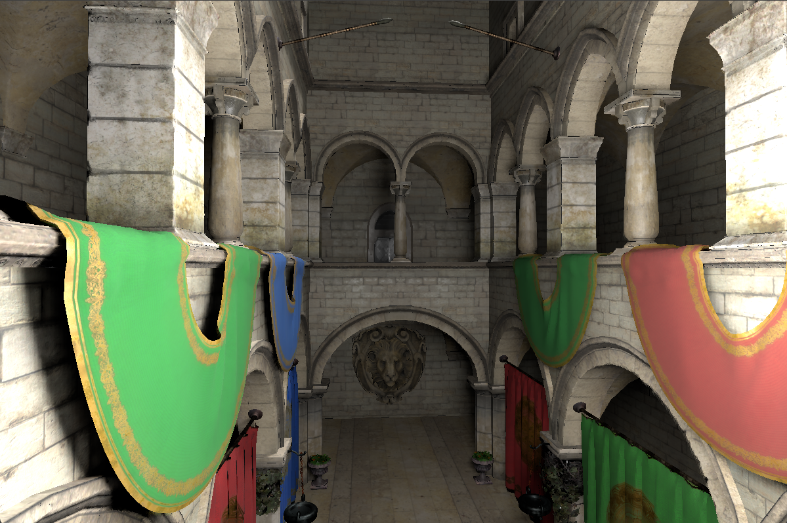
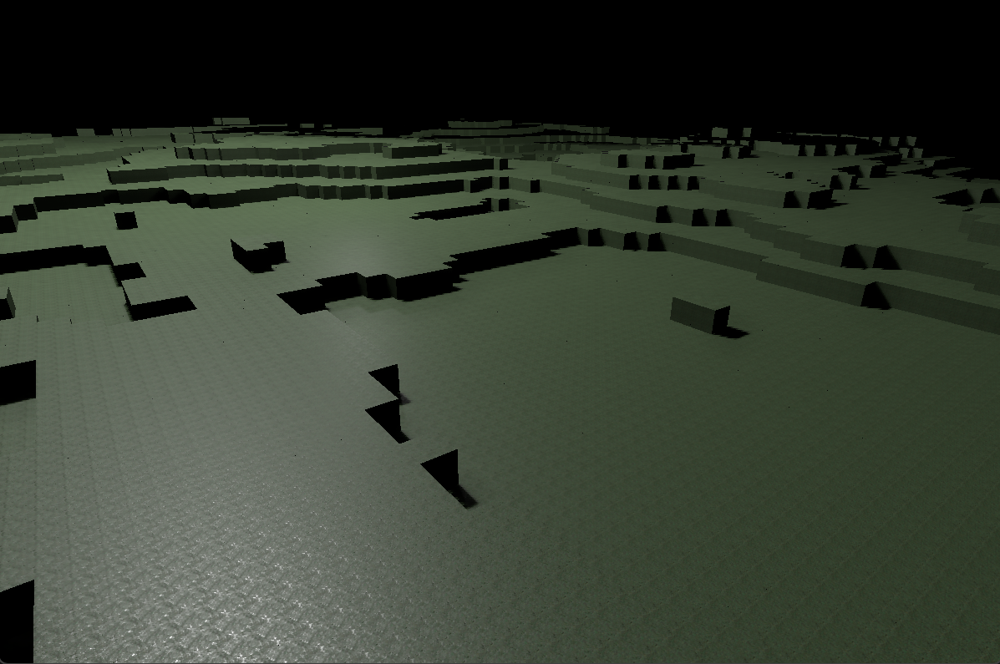
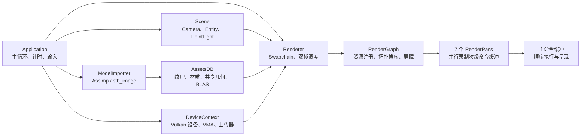

# th1nk2r_renderer

基于 **C++20、Vulkan 1.4 和 Slang** 的 Windows 实时渲染器。当前渲染路径使用延迟几何缓冲、GPU 视锥剔除、Vulkan 光线查询、ReSTIR DI 直接光照采样，以及 NVIDIA NRD RELAX 降噪。渲染任务由 RenderGraph 声明资源用途与节点依赖；各节点的次级命令缓冲并行录制，再按图顺序在主命令缓冲中执行。

## 画面效果

**Sponza 场景：** 石材结构、织物材质及直接光照效果。



**程序生成的方块地形：** 128 × 128 高度图形成的地表与阶梯轮廓。



截图位于 [`docs/images/`](docs/images/)。当前示例程序在同一场景中创建 Sponza 与地形；截图展示了其中不同区域。

## 系统架构


```mermaid
flowchart LR
    A[Application<br/>主循环、计时、输入] --> S[Scene<br/>Camera、Entity、PointLight]
    A --> I[ModelImporter<br/>Assimp / stb_image]
    I --> D[AssetsDB<br/>纹理、材质、共享几何、BLAS]
    A --> C[DeviceContext<br/>Vulkan 设备、VMA、上传器]
    A --> R[Renderer<br/>Swapchain、双帧调度]
    S --> R
    D --> R
    C --> R
    R --> G[RenderGraph<br/>资源注册、拓扑排序、屏障]
    G --> P[7 个 RenderPass<br/>并行录制次级命令缓冲]
    P --> B[主命令缓冲<br/>顺序执行与呈现]
```

| 层次 | 当前职责 |
| --- | --- |
| `platform`、`core` | GLFW 窗口与回调；输入路由、自由飞行相机、帧间计时和 8 工作线程的任务池。 |
| `gfx` | Vulkan 实例、设备与队列、交换链、双帧同步、VMA Buffer/Image、上传器及图形/计算管线。Vulkan 对象使用 Vulkan-Hpp RAII 封装。 |
| `io`、`resource` | Assimp 模型解析、stb_image 图像解码、SPIR-V 读取；CPU 导入数据、类型化 `ResourceId<T>`、资产池、共享顶点/索引/材质缓冲和网格 BLAS。 |
| `scene` | 相机、点光源、实体及 `Transform`/`MeshRenderer` 组件；基于高度图的方块地形生成。 |
| `render` | `Renderer` 管理帧获取、记录、提交和呈现；`RenderGraph` 管理具名图像/缓冲、节点依赖、资源状态转换和动态渲染附件。 |
| `shaders` | Slang 顶点、片元、计算着色器与共享光照逻辑；构建时编译为 SPIR-V。 |

### 帧内数据流

| 顺序 | RenderGraph 节点 | 输入与输出 |
| --- | --- | --- |
| 1 | `tlas_build` | 根据场景模型实例与已构建的网格 BLAS 建立当前在途帧的 TLAS，供光线查询使用。 |
| 2 | `culling` | 将实体的模型变换、网格 AABB 和材质索引写入逐帧实例缓冲；计算着色器完成六平面视锥测试，生成间接索引绘制命令与可见计数。 |
| 3 | `geometry` | `drawIndexedIndirectCount` 绘制可见网格，写入基础色/遮蔽、世界空间法线/粗糙度、自发光/金属度、运动向量及深度 G-buffer。 |
| 4 | `restir_di` | 从 G-buffer 重建表面，采样点光源球面位置并使用 `RayQuery` 测试可见性；生成当前与最终逐像素 reservoir。默认开启空间复用，关闭时域复用。 |
| 5 | `direct_light` | 使用最终 reservoir、材质与 TLAS 计算直接光照；漫反射辐射/命中距离写入半分辨率图像，镜面分量写入全分辨率图像。 |
| 6 | `direct_light_denoise` | 将深度、法线、粗糙度及运动向量转换为 NRD 输入，分别以 `RELAX_DIFFUSE` 和 `RELAX_SPECULAR` 处理漫反射与镜面信号。 |
| 7 | `direct_light_composite` | 基于深度和法线为半分辨率漫反射选择邻近样本，恢复材质因子并叠加全分辨率镜面分量，写入交换链图像。 |

| 关键中间资源 | 格式与粒度 |
| --- | --- |
| 基础色/遮蔽 G-buffer | `R8G8B8A8_SRGB`，全分辨率、逐帧 |
| 法线/粗糙度、自发光/金属度、运动向量 G-buffer | `R16G16B16A16_SFLOAT`，全分辨率、逐帧 |
| 几何深度 | `D32_SFLOAT`，全分辨率、逐帧 |
| ReSTIR reservoir | 每像素 32 字节；当前与最终两个共享 Buffer |
| 直接光照与 RELAX 输出 | `R16G16B16A16_SFLOAT`；漫反射半分辨率，镜面全分辨率 |

`RenderGraph::compile()` 对依赖做拓扑排序，汇总资源用途并生成图像布局转换与 Buffer 屏障。每帧在等待对应 Fence 并获取交换链图像后，所有 Pass 先执行 `prepare()`；随后 7 个 `record()` 任务进入线程池。主线程等待任务结果，将次级命令缓冲按图顺序连同屏障录入一个 Primary Command Buffer，执行一次 Graphics Queue 提交，再呈现图像。图形节点采用 Vulkan 动态渲染。窗口尺寸变化、最小化以及 `OUT_OF_DATE`/`SUBOPTIMAL` 会触发交换链、图资源和 Pass 的重建。

### 资源与场景

`ModelImporter` 递归扫描 `assets/models/` 中的 `.obj`、`.fbx`、`.gltf` 和 `.glb` 文件。模型默认以其所在目录名注册；同名目录中的模型会发生名称冲突。Assimp 将网格三角化并准备法线、切线与 UV；材质记录基础色、Metallic-Roughness、法线、遮蔽、Alpha Mask 和自发光数据。外部或嵌入式材质图像解码为 RGBA8；基础色/自发光使用 sRGB 纹理，其他数据图使用 UNORM 纹理，同一来源的编码变体分别缓存。

`AssetsDB` 在导入阶段收集 CPU 网格与材质，导入完成后一次性建立共享顶点、索引和材质 Buffer。每个 `Model` 引用一组 `Primitive`，每个 `Primitive` 引用网格与材质 ID；`Mesh` 保存共享缓冲中的元素偏移、索引数量和模型空间 AABB。材质纹理通过描述符数组按资源 ID 索引。上传完成后，每个网格建立一个 BLAS；运行时 TLAS 由模型实例引用这些 BLAS。材质纹理通过暂存资源上传并生成 2D Mipmap 链。

默认 `Application::setup_scene()` 使用随机 seed 和 `dense_green_grass_sharp` 预览方块模型生成 128 × 128 地形，采用四层 Value Noise 计算高度，默认高度为 1–10 个方块。生成器为顶面、侧边或底面外露的方块创建实体，方块之间共享同一模型资源。场景另有位置为 `(0, 10, 0)` 的 Sponza 实体与两盏点光源；相机初始位置为 `(0, 20, 0)`，垂直视场角 60°。模型目录中的其他预览 GLB 也在启动时导入，但不会自动成为场景实体。

### 当前渲染边界

- ReSTIR DI 默认每像素产生 1 个初始候选，并在 30 像素半径内检查 5 个空间邻居；时域复用的代码与参数存在，但默认设置为关闭。NRD 仍使用当前帧和历史帧的相机及运动信息进行降噪。
- TLAS 在每个在途帧首次建立后保持静态；后续实体增删或变换不会更新该帧 TLAS。几何绘制的实例数据则按帧重新准备。
- G-buffer 保留自发光 RGB，但当前最终合成着色器只读取同一纹理的金属度 Alpha 通道，输出为降噪后的直接光照漫反射与镜面分量之和。仓库中的 HDR 环境图当前未进入启动或渲染路径。
- 光线查询使用 opaque 三角形命中；几何 Pass 的 Alpha Mask 裁剪不参与 BLAS/TLAS 命中判定。
- 每个剔除 Pass 和 TLAS Pass 的实例容量均为 65,536；实际可用数量还受 GPU 设备限制和场景模型的 Primitive 数量影响。

## 核心技术实现

### 资产导入、统一缓冲与材质寻址

`ModelImporter` 按路径排序后逐一导入模型。Assimp 将网格三角化、预变换顶点，并生成或提取法线、切线、UV 和顶点色；导入结果先保存在 CPU 侧 `MeshData` 与 `MaterialData` 中。材质的五类纹理分别解析为基础色、Metallic-Roughness、法线、遮蔽和自发光。缺失纹理使用 1 × 1 白色或平坦法线贴图；同一图像若同时用于颜色与线性数据，会分别建立 sRGB 和 UNORM 资源。[model_importer.cpp](src/resource/importer/model_importer.cpp)

每个 `Mesh` 在登记时确定共享顶点/索引缓冲中的元素范围，局部索引不重写；`AssetsDB::upload()` 一次性分配 GPU Buffer，`BufferUploader` 通过暂存 Buffer 批量复制并用 Fence 等待完成。全局材质 Buffer 的每条 `GpuMaterial` 固定为 96 字节，包含材质因子、Alpha Mask 标志及五个纹理索引。`Material::buffer_index` 指向该记录，纹理索引与 `ResourceId<Texture>` 数值一致，几何片元着色器据此索引描述符数组。上传开始后数据库不再接收新的 Mesh 或 Material。[assets_db.cpp](src/resource/storage/assets_db.cpp) · [material.hpp](include/resource/gpu/material.hpp)

材质纹理使用 `R8G8B8A8_SRGB` 或 `R8G8B8A8_UNORM`。`Texture` 根据最大边长计算完整 Mipmap 层数；上传器要求格式支持线性 Blit，并逐层执行 Transfer 布局转换、缩小采样及最终 Shader Read 布局转换。几何 Pass 使用线性过滤和各向异性采样。[texture.cpp](src/resource/texture.cpp) · [image_uploader.cpp](src/gfx/device/image_uploader.cpp)

### RenderGraph：依赖排序与资源同步

各 Pass 通过 `configure()` 声明节点依赖以及图像、Buffer 的读写用途。`RenderGraph::compile()` 对显式依赖执行拓扑排序，按资源在执行序列中的用途计算 Pipeline Stage、访问掩码和图像布局，并在相邻使用点之间生成 `vk::ImageMemoryBarrier` 或 `vk::BufferMemoryBarrier`。资源声明可选择 `Single` 或 `PerFrame`；后者按两个在途帧分别分配，交换链图像则作为外部资源绑定。呈现目标在最终节点后转换为 `ePresentSrcKHR`。TLAS 与 NRD 私有引导图像不属于图注册资源，其同步由对应 Pass 直接录制。实现见 [RenderGraph](src/render/render_graph.cpp)。

CPU 侧并行仅作用于命令**录制**：每个节点使用当前帧独立的 Command Pool 和 Secondary Command Buffer，7 个录制回调提交给 8 线程任务池。主线程获取全部 `future` 后，将屏障和节点命令按拓扑顺序组装进一个 Primary Command Buffer；GPU 通过单次 Graphics Queue 提交执行。几何、直接光照与合成节点由主命令缓冲以动态渲染的附件范围包围。

图像用途同时决定创建时需要的 `ColorAttachment`、`Sampled` 或 `Storage` 等 Usage Flag；`PerFrame` 资源按当前帧索引寻址，而 ReSTIR 的当前/最终 reservoir 使用 `Single` 资源跨帧保留数据。屏障覆盖整张图像的全部 Mipmap 与数组层，或整个 Buffer。图形节点的颜色/深度附件由图在执行节点时组装并清空；Pass 只负责录制附件内部的绘制命令。编译阶段检查循环依赖与未声明资源；录制阶段检查同一节点附件的尺寸和采样数是否一致。

### 双帧同步与交换链恢复

`FramesInFlight` 固定维护两个帧槽，每槽持有 Primary Command Pool、Primary Command Buffer、`image_available` Semaphore 和初始为 Signaled 的 Fence。渲染前等待当前槽 Fence，获取交换链图像并重置命令池；提交前重置 Fence。Graphics Queue 等待图像可用信号，执行主命令缓冲并触发与**交换链图像索引**对应的 `render_finished` Semaphore；Present Queue 等待后者。两类索引分离，使帧槽同步对象与交换链图像的呈现信号各自匹配。[frames_in_flight.cpp](src/gfx/frame/frames_in_flight.cpp) · [renderer.cpp](src/render/renderer.cpp)

交换链优先选择 `B8G8R8A8_SRGB` 表面格式和 Mailbox 呈现模式，缺失时分别使用首个可用格式与 FIFO；图像数取最小要求加一并受最大值约束。图形/呈现队列族不同时使用 Concurrent 图像共享。窗口尺寸为零时，重建路径等待事件；恢复后等待设备空闲，以旧交换链创建新实例，并重新声明图资源、构建 RenderGraph、初始化全部 Pass。窗口尺寸变化、Acquire 的 `OUT_OF_DATE`，以及 Acquire/Present 的 `SUBOPTIMAL` 或 Present 的 `OUT_OF_DATE` 都进入此路径。[swapchain.cpp](src/gfx/frame/swapchain.cpp)

### GPU 视锥剔除与间接绘制

`CullingPass::prepare()` 将场景中每个 `MeshRenderer` 的 `Primitive` 展平成一条 240 字节渲染实例记录，并写入按帧分配、持久映射的上传 Buffer。记录包含当前/上一帧模型矩阵、法线矩阵、网格模型空间 AABB、索引范围、材质索引和运动有效标志。相机 View-Projection 矩阵提取 Vulkan ZO 裁剪空间的六个视锥平面，连同实例数和最大命令数写入 112 字节 Push Constant。[culling_pass.cpp](src/render/pass/culling/culling_pass.cpp)

`GeometryPass` 绑定共享顶点/索引 Buffer 和材质描述符后，以 `drawIndexedIndirectCount()` 读取 GPU 生成的命令与计数。可见数量无需回读 CPU；每帧最多容纳 65,536 个 `Primitive` 实例。G-buffer 同时记录由上一帧模型与相机矩阵计算的运动向量，供降噪和可选的 ReSTIR 时域复用使用。[geometry_pass.cpp](src/render/pass/geometry/geometry_pass.cpp)

剔除命令先用 `fillBuffer` 将逐帧可见计数清零，再以 Transfer→Compute 屏障保证计算着色器读取到清零结果。每个 Workgroup 包含 64 个线程；线程把模型空间 AABB 中心变换到世界空间，并用模型矩阵各轴向量的绝对值计算世界空间外包盒半径，逐个测试六个视锥平面。可见实例通过 `InterlockedAdd` 取得间接命令写入位置。剔除计算的写入与 Geometry Pass 的间接命令读取之间由 RenderGraph 生成 Buffer 屏障；命令中的 `firstInstance` 保留原始实例下标，使压缩后的绘制命令仍能访问对应变换和材质。[culling.slang](shaders/compute/culling.slang)

### G-buffer、材质计算与运动向量

Geometry Pass 使用四个颜色附件和一个深度附件。基础色附件为 sRGB 格式，其 RGB 由基础色纹理、顶点色和材质因子相乘，Alpha 保存线性 AO；其他附件分别保存世界空间法线/粗糙度、自发光/金属度、运动向量，深度使用 `D32_SFLOAT`。法线贴图先从 `[0,1]` 解码到切线空间，再用正交化切线、副切线和世界法线变换；Metallic-Roughness 纹理按 glTF 的 G/B 通道读取。Alpha Mask 在片元阶段依据 Cutoff 执行裁剪，因此被裁剪像素不写入 G-buffer。[geometry_fragment.slang](shaders/fragment/geometry_fragment.slang)

`CullingPass` 按实体 ID 保存上一帧模型矩阵；只有上一帧仍是同一模型资源时，实例运动才标记为可用。Geometry Pass 同时保存上一帧相机 View-Projection 矩阵。顶点着色器分别计算当前与上一帧 Clip 坐标；片元着色器在上一帧投影位于有效视域内时输出 `previousUV − currentUV`，Z 通道为上一帧与当前 View Depth 之差，W 通道标记有效性。首次渲染、模型 ID 变化或无效投影均产生无效运动记录，NRD 引导着色器对此写入无效运动哨兵值。[geometry_vertex.slang](shaders/vertex/geometry_vertex.slang) · [direct_light_denoise.slang](shaders/compute/direct_light_denoise.slang)

### BLAS/TLAS 与光线查询

资产上传完成后，`AssetsDB::build_blas()` 按网格创建 BLAS。三角形数据直接引用共享顶点/索引 Buffer 的设备地址：顶点位置为 `R32G32B32_SFLOAT`，索引为 32 位整数，网格的顶点偏移与首索引决定该 BLAS 的输入范围。构建阶段按设备要求对齐暂存地址，以一块满足最大需求的 Scratch Buffer 依次构建各个 BLAS，并在相邻构建之间插入加速结构写入屏障。BLAS 的资源 ID 与对应 Mesh ID 保持一致，供场景实例直接查找。[assets_db.cpp](src/resource/storage/assets_db.cpp)

`TlasBuildPass` 遍历场景实体及其模型的 `Primitive`，为每个 Primitive 写入一条 64 字节的 Vulkan 加速结构实例记录。记录包含由模型矩阵转置布局得到的 3 × 4 变换、BLAS 设备地址、实例索引和 `0xFF` 可见性掩码；实例 Buffer 按在途帧分别分配，Host 写入后通过 Host→Acceleration Structure Build 屏障同步。TLAS 和 Scratch Buffer 同样按帧持有。每个帧槽首次使用时执行 Build，随后 `prepare()` 直接返回，因此场景实体或变换变化不会触发 TLAS 更新。[tlas_build_pass.cpp](src/render/pass/tlas_build/tlas_build_pass.cpp)

ReSTIR 和直接光照着色器以 `RayQuery` 对 TLAS 执行遮挡或最近命中查询，阴影射线起点沿表面法线偏移。查询强制将三角形视为不透明；它使用几何加速结构中的网格数据，不执行 Geometry Pass 的 Alpha Mask 片元裁剪。[restir_di.slangh](shaders/common/restir_di.slangh) · [direct_light_fragment.slang](shaders/fragment/direct_light_fragment.slang)

### ReSTIR DI：候选采样与空间复用

每个像素持有一条 32 字节 `Reservoir`，字段包括光源索引、球面采样坐标、归一化权重、目标函数值、候选数、深度，以及压缩的法线/粗糙度/金属度。初始阶段从点光源集合均匀抽取光源，再以两个 16 位分量确定光源球面上的采样位置。目标函数是基于漫反射加 GGX 镜面 BRDF、光源强度和距离衰减所得直接光照贡献的亮度。候选权重为目标值乘光源数量，按加权 reservoir 更新选中样本；归一化权重为累计权重除以候选数与选中目标值。初始样本还要通过 `RayQuery` 验证可见性。[restir_di.slangh](shaders/common/restir_di.slangh) · [restir_di_initial_temporal.slang](shaders/compute/restir_di_initial_temporal.slang)

空间阶段以随机旋转的低差异序列在屏幕圆盘内选择邻居。只有线性视深度的相对差、法线夹角余弦、粗糙度差和金属度差通过阈值检查时，邻居 reservoir 才参与合并；其样本在当前表面重新计算目标函数，并以“新目标值 × 邻居归一化权重 × 邻居候选数”进入加权更新。默认配置为每像素 1 个初始候选、5 个空间邻居、30 像素半径；深度相对阈值为 0.1，法线余弦下限约为 0.906，粗糙度与金属度差阈值均为 0.2。代码包含通过运动向量读取上一帧最终 reservoir 的时域路径，当前默认设置关闭该路径、开启空间复用。[restir_di_spatial.slang](shaders/compute/restir_di_spatial.slang) · [restir_di_pass.hpp](include/render/pass/restir_di/restir_di_pass.hpp)

直接光照阶段从最终 reservoir 读取选中的球面光源样本，重新查询其可见性，并计算漫反射和镜面贡献；无有效样本时仍为两个分量分别发射一次方向采样射线，以生成降噪所需的首段命中距离。[direct_light_fragment.slang](shaders/fragment/direct_light_fragment.slang)

### NRD RELAX：双分辨率信号链

直接光照 Pass 只在全分辨率像素坐标均为偶数时，将漫反射写入坐标右移一位的半分辨率 Storage Image；镜面始终写入全分辨率颜色附件。两个输入信号的 RGB 由已计算的直接光照分量除以对应材质因子，并限制在 `[0, 250]`；Alpha 是限制在 FP16 有限范围内的命中距离。没有有效 ReSTIR 样本时，着色器对漫反射与镜面分别采样一条方向射线取得降噪所需的命中距离。[direct_light_fragment.slang](shaders/fragment/direct_light_fragment.slang)

降噪引导计算着色器用投影参数将 G-buffer 深度转换为线性 View-Z，把世界法线、粗糙度和材质分类打包为 `R10_G10_B10_A2_UNORM`，并生成全分辨率与半分辨率两套深度、法线和运动数据。无效运动写入 `(100, 100, 0, 0)` 哨兵值；半分辨率引导数据取对应 2 × 2 区域的偶数坐标像素。`DirectLightDenoisePass` 通过 NRI 分别建立 `RELAX_DIFFUSE` 和 `RELAX_SPECULAR` 集成实例，传入当前/上一帧相机矩阵。首帧设置 `CLEAR_AND_RESTART`，之后为 `CONTINUE`；默认 Atrous 迭代数为 1，两个分量的最大累积帧数为 30。[direct_light_denoise.slang](shaders/compute/direct_light_denoise.slang) · [direct_light_denoise_pass.cpp](src/render/pass/direct_light_denoise/direct_light_denoise_pass.cpp)

最终合成在需要补齐半分辨率漫反射的像素上检查相邻 2 × 2 个低分辨率候选，仅接受法线点积达到阈值的候选，并选线性 View-Z 差最小者。合成阶段将降噪后的漫反射与全分辨率镜面分别乘回材质因子，再求和写入交换链图像。无几何像素输出黑色；这条路径没有叠加 G-buffer 中的自发光 RGB。[direct_light_composite_fragment.slang](shaders/fragment/direct_light_composite_fragment.slang)

### 四层 Value Noise 与可见方块生成

`TerrainGenerator` 为固定的 128 × 128 网格计算高度图。整数坐标经种子哈希得到格点值，格点间使用五次平滑曲线和双线性插值形成 Value Noise；四个 Octave 逐层将采样频率加倍、振幅减半，再以振幅和归一化。结果映射到配置高度范围并四舍五入，默认高度为 1–10 个方块，噪声基准频率为每方块 0.035。应用启动时从 `std::random_device` 取得种子，因此默认启动场景的地形分布可变。[terrain_generator.cpp](src/scene/terrain_generator.cpp) · [application.cpp](src/core/application.cpp)

生成实体时，每一列固定保留最底层方块与顶层方块。内部列还根据四个相邻列的最小高度添加侧面可能露出的方块；边界列将外部视为空气。每个保留方块都是持有同一个立方体模型 ID 的独立 `MeshRenderer` 实体，其位置位于网格单元中心，尺寸由 `block_size` 控制。该阶段按方块过滤内部体积，不对单个立方体的面做裁剪；后续仍通过通用 GPU 视锥剔除与间接绘制路径处理。[terrain_generator.cpp](src/scene/terrain_generator.cpp)

## 构建与运行

当前 `xmake.lua` 固定 **Windows x64、MSVC、C++20**。构建需要 Xmake、可在 `PATH` 调用的 `slangc`、Git，以及支持 Vulkan 1.4 的显卡、驱动和 Vulkan SDK。Xmake 声明了 Vulkan SDK、GLFW、GLM、VMA、stb_image、Assimp 6.0.4 和 CMake 依赖。GPU 还须支持图形/计算及呈现队列、Vulkan 动态渲染与间接绘制计数、描述符数组、Buffer Device Address、Acceleration Structure、Ray Query 等代码中启用的特性；纹理和 G-buffer 格式支持在初始化时检查。

首次构建若未指定 SDK 路径，`xmake/rules/nrd.lua` 会获取固定的 **NRD 4.18.0** 源码并用 CMake 构建 NRD/NRI，因此依赖下载与首次准备需要网络。也可以同时设置 `NRD_SDK_ROOT` 和 `NRI_SDK_ROOT` 指向完整的本地 SDK。`slangc` 将 `shaders/vertex`、`shaders/fragment`、`shaders/compute` 下的 `.slang` 编译到 `bin/spv/`；Xmake 将 `assets/` 和 `NRD.dll`、`NRI.dll` 部署到 `bin/`。

```powershell
xmake f -m release
xmake build th1nk2r_renderer
Push-Location .\bin
.\th1nk2r_renderer.exe
Pop-Location
```

调试构建使用 `xmake f -m debug` 后重新构建。Debug 模式检测到 `VK_LAYER_KHRONOS_validation` 时启用验证层和 Debug Messenger；不可用时输出警告。程序按 `./spv/` 和 `./assets/` 的相对路径读取运行时文件，因此直接执行时当前工作目录为 `bin/`。

### 操作

程序启动时捕获鼠标；平台支持时开启 Raw Mouse Motion。

| 输入 | 功能 |
| --- | --- |
| 鼠标移动 | 调整视角 |
| `W` / `S` | 前进 / 后退 |
| `A` / `D` | 左移 / 右移 |
| `Space` / `Left Ctrl` | 上升 / 下降 |
| `Left Shift` / `Right Shift` | 加速移动 |
| 按住 `Left Alt` / `Right Alt` | 释放鼠标，并暂停相机移动与旋转 |

## 目录结构

```text
assets/             模型、纹理、HDR 文件与第三方资产授权说明
docs/images/        场景截图
include/            各模块公开类型和接口
src/                core、gfx、io、platform、render、resource、scene 的实现
shaders/            Slang 源码：vertex、fragment、compute、common
xmake/rules/        Slang 编译规则与 NRD/NRI SDK 准备规则
xmake.lua           目标、依赖与构建配置
```

## 授权

项目原创代码、着色器与文档按仓库根目录的 [MIT License](LICENSE) 授权。`assets/` 中的第三方模型、纹理与 HDR 文件适用各自授权，详见 [assets/README.md](assets/README.md)；其中 Sponza 文件的授权状态在资产说明中标记为待核实。第三方库及 SDK 适用其各自许可证。
